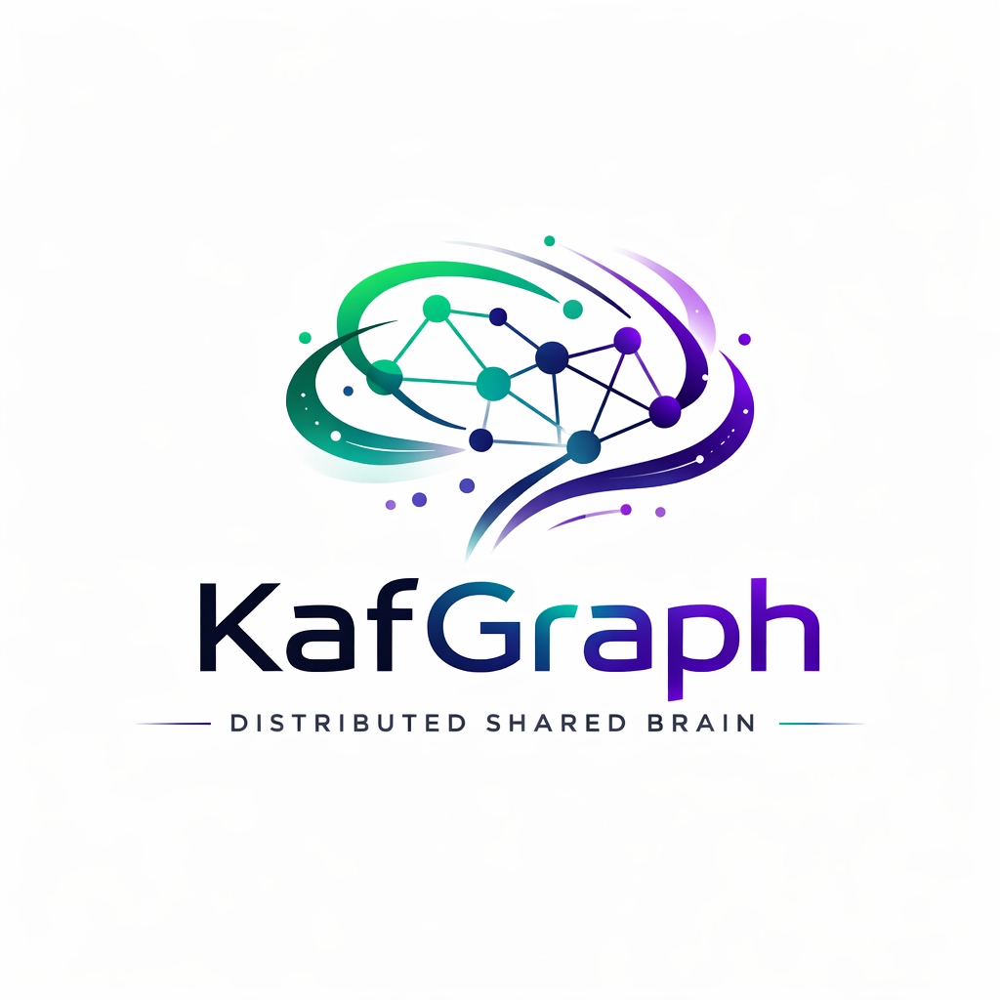

# KafGraph

**KafGraph becomes the distributed shared brain of collaborating agents.**

A self-owned, persistent, agent-accessible knowledge system built as a distributed
graph database in Go.

---

## What Is KafGraph?

KafGraph is the memory layer for AI agent teams. It ingests every conversation,
decision, and artifact that flows through a [KafClaw](https://github.com/kamir/KafClaw)
agent group, structures it as a queryable knowledge graph, and exposes it back to
agents through tool calls — so no agent ever starts from zero.

```
Agent conversations → Kafka topics → KafScale Processor → KafGraph (BadgerDB)
                                                              │
                                      ┌───────────────────────┤
                                      │                       │
                                 Brain Tool API          Cypher / Bolt
                                 (agent access)          (tooling access)
```

## Key Capabilities

- **Agent Brain**: persistent, searchable knowledge graph per agent and per team —
  accessible via `brain_search`, `brain_recall`, `brain_capture` tool calls
- **KafScale Processor**: reads directly from S3 segments (MinIO) using the 5-layer
  processor stack — no broker overload
- **Reflection Service**: daily, weekly, and monthly reflection cycles that score
  conversations by impact, relevance, and value contribution
- **Human Feedback Loop**: tracks both positive and negative impact of agent actions,
  with configurable routing to team leader and expert reviewers
- **Semantic Search**: vector embeddings (HNSW) for meaning-based queries across the
  entire knowledge graph
- **Full-Text Search**: bleve-powered text search on message content, learning signals,
  and shared memory
- **OpenCypher / Bolt**: Neo4j-compatible query interface for tooling and dashboards
- **Two Modes**: per-agent embedded (local brain) or distributed cluster (team brain)

## Why "Distributed Shared Brain"?

That phrase captures both deployment modes in one sentence:

- **Per-agent mode** = each agent has its own local brain (embedded BadgerDB + Brain
  Tool API on localhost)
- **Distributed mode** = all agents in a KafClaw group share a single brain across the
  cluster, partitioned by agentID but queryable cross-agent

### How KafGraph Differs from Platform Memory

- **Claude memory / ChatGPT memory** = private, siloed, vendor-locked
- **KafGraph** = shared (team-wide), distributed (scales with the cluster), and
  self-owned (no SaaS)

### The Compounding Value of a Shared Brain

A private brain only compounds from one agent's experience. A **shared** brain
compounds from the entire team's experience — agent-researcher's findings enrich
agent-coder's context, agent-reviewer's feedback improves everyone's reflection
scores.

The brain compounds through three loops:
1. **Automatic ingestion** — every conversation becomes a graph node with embeddings
2. **Reflection cycles** — the brain learns what mattered (daily/weekly/monthly)
3. **Human feedback** — humans confirm what had real positive or negative impact

### The Three Layers

The story flows across three projects:

| Layer | Project | Role |
|-------|---------|------|
| **Communication** | KafClaw | Agent groups, skill routing, orchestration — the conversations |
| **Infrastructure** | KafScale | Kafka-compatible broker, S3 storage, processor SDK — the platform |
| **Brain** | KafGraph | The place where collective experience becomes searchable, reflectable knowledge |

## Architecture

KafGraph runs as a **KafScale Processor** co-located with KafScale broker nodes.
It consumes from KafClaw group topics (`group.<name>.requests`, `.responses`,
`.skill.*`, `.memory.shared`, etc.) by reading S3 segments directly — no broker
round-trip.

| Component | Technology |
|-----------|-----------|
| Storage engine | BadgerDB (pure Go, LSM-tree, ACID) |
| Segment processing | KafScale 2.7.0 Processor SDK |
| Object storage | MinIO (S3-compatible) |
| Vector index | HNSW (approximate nearest-neighbour) |
| Full-text index | bleve (pure Go) |
| Query language | OpenCypher subset |
| Wire protocol | Bolt v4.4 |
| Cluster membership | hashicorp/memberlist (gossip) |
| Configuration | YAML + env-var overrides (viper) |

## Brain Tool API

Agents interact with the brain through **tool calls** — standard JSON-schema
functions callable from any LLM agent runtime. Two access paths:

| Path | Transport | Use Case |
|------|-----------|----------|
| Direct HTTP | `POST /api/v1/tools/{toolName}` | Co-located / embedded mode |
| KafClaw skill | `group.<name>.skill.kafgraph_brain.*` | Distributed mode (auto-discovered via roster) |

**Available tools:**

| Tool | Purpose |
|------|---------|
| `brain_search` | Semantic search — find nodes by meaning, not keywords |
| `brain_recall` | Load accumulated context at session start (no more zero-start) |
| `brain_capture` | Write insights, decisions, observations into the brain |
| `brain_recent` | Browse recent activity within a time window |
| `brain_patterns` | Surface recurring themes and connections |
| `brain_reflect` | Trigger on-demand reflection and get results inline |
| `brain_feedback` | Submit human feedback on reflection cycles |

## KafClaw Integration

KafGraph consumes the full KafClaw group topic hierarchy:

```
group.<group_name>.announce              → Agent nodes
group.<group_name>.requests / responses  → Conversation + Message nodes
group.<group_name>.skill.*.requests/responses → Skill-specific conversations
group.<group_name>.memory.shared         → SharedMemory nodes
group.<group_name>.observe.audit         → AuditEvent nodes
group.<group_name>.control.roster        → Dynamic skill topic discovery
group.<group_name>.orchestrator          → Agent hierarchy edges
```

See [SPEC/kafclaw-topic-reference.md](SPEC/kafclaw-topic-reference.md) for the
full topic model and wire format.

## Project Status

KafGraph is in the **specification phase**. No source code yet.

| Document | Description |
|----------|------------|
| [SPEC/initial-idea.md](SPEC/initial-idea.md) | Original vision and open questions (all resolved) |
| [SPEC/requirements.md](SPEC/requirements.md) | Functional, non-functional, and integration requirements |
| [SPEC/solution-design.md](SPEC/solution-design.md) | Architecture, component design, phased delivery plan |
| [SPEC/kafclaw-topic-reference.md](SPEC/kafclaw-topic-reference.md) | KafClaw topic naming, wire format, and KafGraph mapping |
| [SPEC/about-agent-brains.md](SPEC/about-agent-brains.md) | Foundational thinking on agent-readable memory systems |

## Phased Delivery

| Phase | Milestone |
|-------|-----------|
| 0 — Foundation | BadgerDB, graph API, Bolt handshake, config |
| 1 — Processor | KafScale 5-layer processor, KafClaw GroupEnvelope ingestion |
| 2 — Query | OpenCypher parser, vector index (HNSW), full-text index (bleve) |
| 3 — Agent Brain | Brain Tool API, KafClaw skill registration, context loading, embedding integration |
| 4 — Reflection | Scheduler, isolated historic iterator, scoring, LearningSignal nodes |
| 5 — Feedback | Human feedback loop, positive/negative impact, team leader + expert routing |
| 6 — Distribution | Cluster mode, gossip, cross-partition routing, brain-captures sync |
| 7 — Hardening | TLS, encryption at rest, OTel tracing, Helm chart, load tests |

## License

Apache 2.0 — see [LICENSE](LICENSE).
