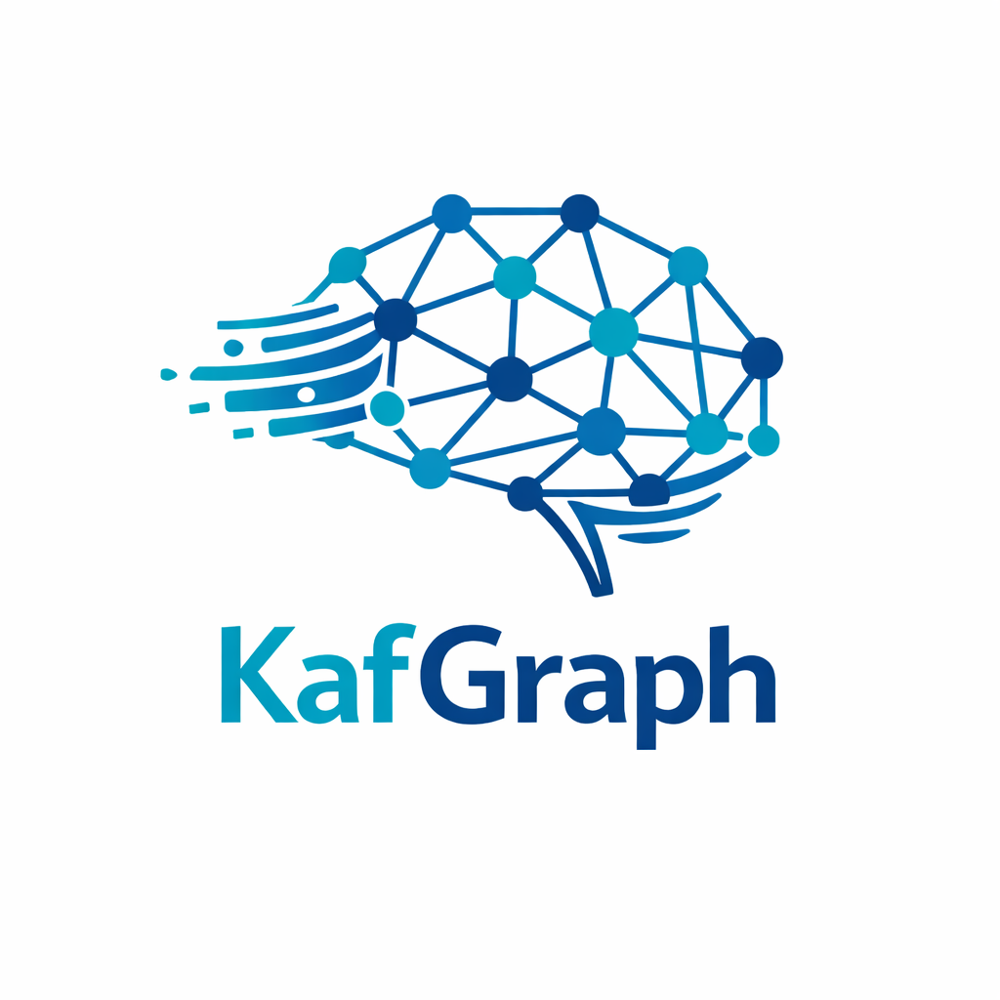
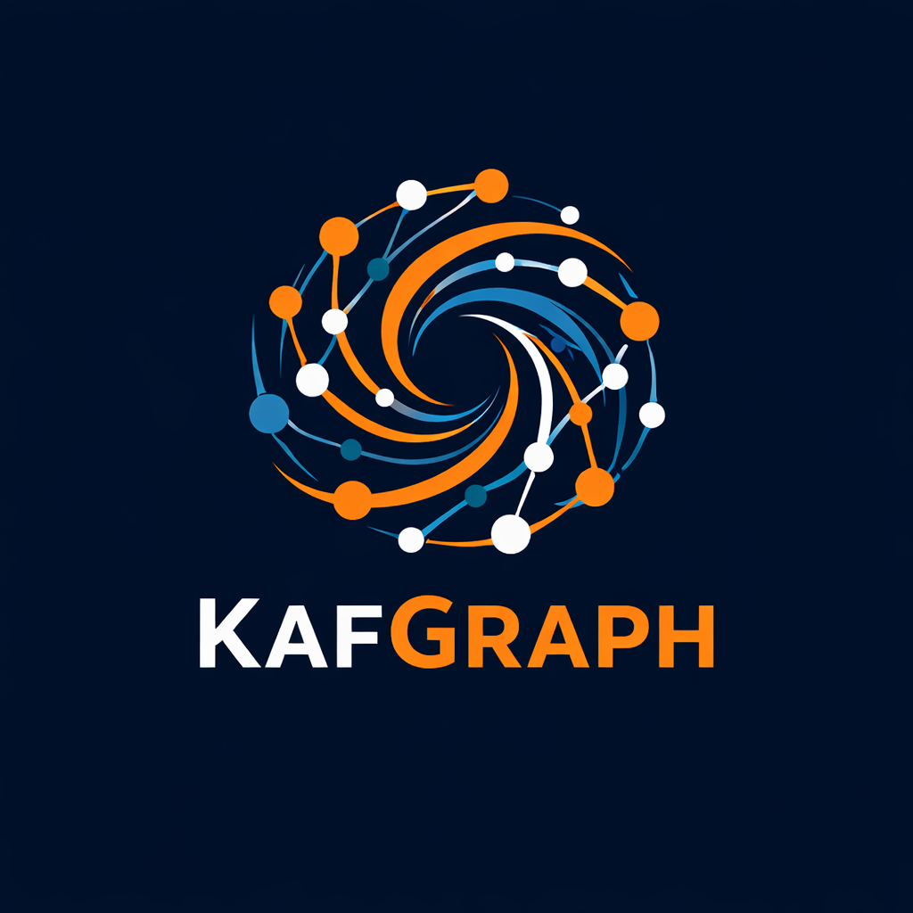

Stilisiertes Brain‑Netzwerk – das Logo zeigt ein abstrahiertes Gehirn aus Knoten und Linien in Blau‑ und Tealtönen. Es symbolisiert die Vernetzung und die „geteilte Intelligenz“ von KafGraph.

Dynamische Spirale – hier bilden verschlungene Knoten und Linien eine Spirale, die in Marineblau, Orange und Weiß gehalten ist. Die Form vermittelt Bewegung und Wachstum und steht für den Datenfluss in einer verteilten Umgebung.

Wellen und Knoten – dieses Logo verbindet abstrakte Wellenformen, die an Kafka‑Message‑Streams erinnern, mit einem Graph aus Knoten. Ein Farbverlauf von Grün zu Lila verleiht dem Entwurf Tiefe und Modernität.
